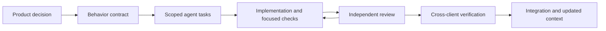

# Building Pet-Easy with agents and skills

Pet-Easy is an AI-assisted development project directed by **Tilemachos Tragakis**. My work includes defining the product, choosing its technology direction, reviewing the interface and using agents to carry requirements through implementation and verification.

The useful part of working with agents is giving each task a clear purpose, relevant context and an observable result. The project uses written decisions, shared behavior contracts and ten reusable skills to support that process.

## Ten skills with distinct responsibilities

| Skill | Responsibility |
|---|---|
| Product | User outcomes, scope, priorities and acceptance proposals |
| UX | Journeys, navigation and interaction states |
| UI | Visual direction, component presentation and consistency |
| Architecture | Technical tradeoffs and shared behavior contracts |
| Django | Backend behavior, services and application permissions |
| React | Browser components, state and API integration |
| Kotlin | Native Android behavior, lifecycle and API integration |
| PostgreSQL | Schema, migrations, constraints and query behavior |
| Docker | Reproducible builds and container configuration |
| Verification | Cross-client journeys and integration regressions |

These are scoped workflows selected for a task. The skill library combines project-specific guidance with reviewed, attributed adaptations of upstream material. Responsibilities are deliberately narrow: a visual task cannot silently redefine product behavior, and a passing client build cannot establish database correctness.

## From a product decision to evidence

Independent work can run in parallel with clear file ownership. Shared changes are reconciled against the agreed contract. Reviews look for observable failures, compatibility issues and missing evidence; findings become focused follow-up work.

Durable project notes preserve decisions between sessions. They distinguish user choices, engineering selections and proposals, so an agent resuming work does not treat an old suggestion as an approved requirement.

## Example: the shared timeline redesign

The product direction changed from separate pet lanes to **one shared date axis**, with actual gradients for pet accents. That visual decision affected several parts of the application:

1. **Define the interaction.** An isolated event sits above the axis. Two overlapping events alternate above and below. Larger groups show their complete count and expand into an inline grid. Grouping follows the current zoom.
2. **Keep clients aligned.** React and native Compose implement the same behavior, using a shared set of 24 gradient presets.
3. **Preserve existing data.** Adding a gradient endpoint keeps older solid colors and older-client updates valid.
4. **Exercise difficult states.** Check mixed pets and dates, long overlap chains, birthdays, filtering, access changes, small screens and keyboard focus.
5. **Check the complete journey.** A synthetic profile and event created in the browser were inspected on Android; a gradient saved on Android was then verified in a fresh browser view.

This connects a visible product improvement to layout algorithms, API compatibility, persistence and cross-client acceptance. The [verification summary](VERIFICATION.md) records the boundaries of that evidence.

## What the portfolio demonstrates

The project shows how I turn product requirements into scoped technical work, coordinate specialized agent workflows, review results and maintain continuity across a growing application. Codex contributes implementation, tests, research and documentation; the portfolio does not imply that every line was written manually.

Public materials include the interface, engineering explanations and a [runnable recurrence example](https://github.com/RagDel/completion-recurrence). Private source, project instructions, user records and operational configuration are outside this showcase.
