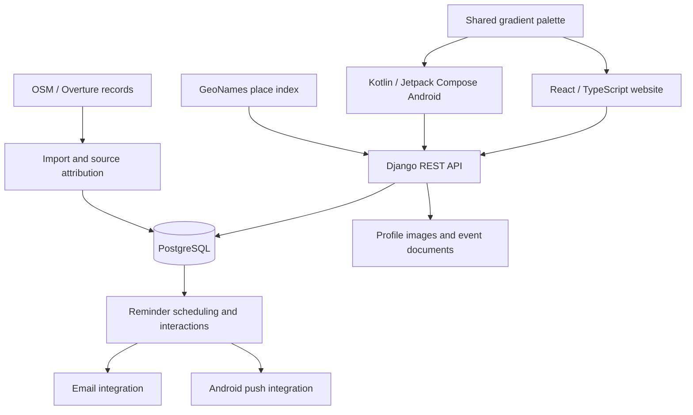

# Architecture and engineering decisions

Pet-Easy combines a React website and a native Kotlin Android app around shared pet-care records. The engineering challenge is keeping dates, permissions, edits and reminders consistent while each client offers an experience suited to its platform.

This diagram shows logical responsibilities in the implementation. Managed cloud deployment is an upcoming milestone; the diagram does not describe a live hosted service.

## A timeline built around actual dates

All selected pets share one horizontal axis. Events keep their actual date anchors as users pan, zoom and filter. At each scale, the clients identify connected groups of overlapping markers: a single marker sits above the axis, two alternate above and below, and three or more become a counted group. A group can contain several pets and nearby dates.

Expanding a group reveals a bounded grid with each pet, category and date, followed by details on the same page. Long collision chains keep a reachable group control even when their centre moves outside the visible window. Birthdays participate in grouping without becoming editable care events.

This behavior makes dense histories useful on small screens while preserving individual records. Saving an event focuses it in the timeline; Today recentres the date without changing the user's scale or filters.

## One visual contract, two client implementations

Both clients consume the same 24-gradient preset collection. Pet records store the chosen color values, allowing custom adjustments without depending on a particular preset version. A second color extends the existing solid-color model; older records keep their appearance and older clients can use the first color.

The shared contract defines behavior and data. React and Compose implement their own layouts, navigation and platform interactions. Greek/English presentation, permission states, date semantics and the saved palette are checked across both clients.

## Shared care under concurrent changes

Owners control invitations and choose viewing or editing access. Caregivers can leave a shared pet without removing the owner's records. The API applies the same rights to profile changes, events and attached documents, and clients clear stale views after access changes.

Writes carry a record version so conflicting changes are surfaced instead of silently overwriting newer work. Retry identities allow an interrupted create or attachment upload to be repeated without creating another copy. Completing an event creates its successor once, including when requests arrive concurrently. Attributed history connects changes to the care record.

## Calendar rules that match the product

Repeats count from actual completion. A monthly interval follows calendar months, including month-end clamping, rather than assuming every month has the same number of days. Calendar reminders retain their local clock through daylight-saving changes; hourly offsets represent elapsed time. Medical repeats start unselected and use the interval chosen by the owner.

Android snoozes and dismissal follow-ups form a separate reminder interaction flow. The implementation preserves accepted snoozes when callbacks arrive late, handles repeated requests, and stops queued follow-ups when a record is completed or becomes ineligible. Email and Android preferences remain independent.

The public [completion-recurrence Python sample](https://github.com/RagDel/completion-recurrence) makes a focused date-only part of this work runnable. It does not reproduce the complete application's scheduling or notification system.

## Geospatial discovery with traceable sources

Provider search sorts the matching records by distance before pagination. Map movement and selected place results refresh the search; event forms narrow results to relevant services and can reuse the last saved provider for that pet and service.

The Greece directory contains 3,124 source-attributed OpenStreetMap/Overture records. A separate GeoNames index supports Greek/Latin city and area names. Source records retain their identity: nearby entries are not silently treated as one verified business. Map clusters count the results on the current page, and reviews open through external Google Maps links.

## User-facing data controls

Profiles and care events support permission-aware documents and attributed history. Account controls include ZIP export, session management and account deletion with a seven-day cancellation window. Pet-profile deletion has its own recovery flow and is distinguished from account erasure in the product.

## Next engineering milestones

- Managed cloud deployment, production monitoring and hosted acceptance across web and Android.
- Broader physical-device, accessibility, interrupted-journey and notification power-management testing.
- Release distribution and performance evaluation against realistic usage.
- Further professional-care workflows; partner booking, commercial billing and iOS remain future scope.

The [verification summary](VERIFICATION.md) separates implemented behavior, recorded checks and remaining acceptance work. The [agent workflow](AGENT_WORKFLOW.md) explains how scoped skills and review support the development process.
