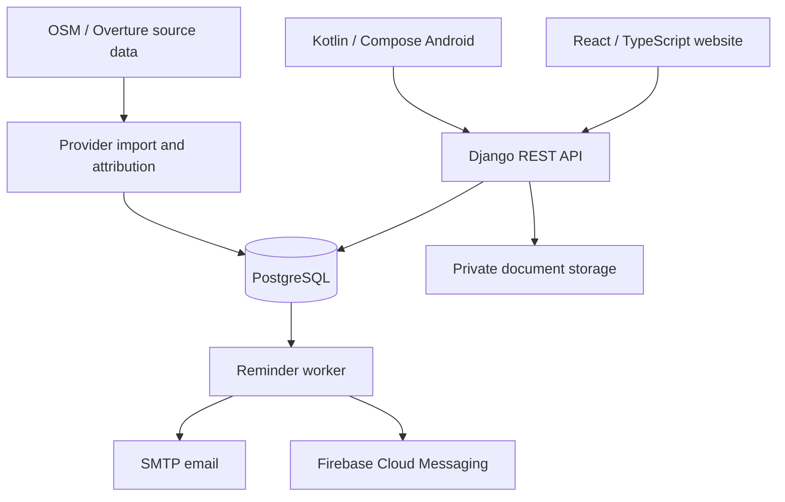

# Architecture and tradeoffs

## One authority for shared records

Both clients use the same API. Permission checks belong on the server, not just in disabled buttons. Owners manage sharing and deletion; invited caregivers may view or edit according to the access granted. Version checks make concurrent edits explicit rather than silently overwriting them.

## Calendar meaning before scheduling machinery

Repeat intervals count from actual completion. Medical repeats start disabled; the owner supplies an interval from veterinary instructions. The public [date-only sample](https://github.com/RagDel/completion-recurrence) demonstrates calendar arithmetic independently. The application also needs transactional completion, retry protection and eligibility checks.

Reminder data persists on the server. Android push and email are independent channels. Snooze and dismissal retries are additional Android notification behaviour, not a promise that an operating system will always deliver at an exact instant.

## Explicit privacy boundaries

Documents require authorized access. Account export and session revocation provide user control. Whole-account deletion has a seven-day cancellation window followed by erasure, with pseudonymous attribution where another owner's history must remain. Restoring an older backup must reapply independent deletion receipts before access reopens.

Pet-profile deletion is different: it is recoverable for seven days and subsequently hidden while retained as deleted. That distinction must remain visible in product language and retention decisions.

## Practical deployment choices

Docker Compose makes local services repeatable and keeps the application portable. A separately prepared production configuration is not evidence of a live deployment. The current application depends on its server; full offline editing is not implemented.

Provider discovery uses source-labelled open data and external map links. Imported records are not proof that a business is currently open, and external ratings/booking are not implied by a map pin.

## What I would revisit with evidence

Hosted operational readiness, physical-device accessibility, realistic load, backup recovery in the chosen hosting environment and actual provider delivery need their own acceptance checks. A small pilot is intended to inform later scaling and product scope.
