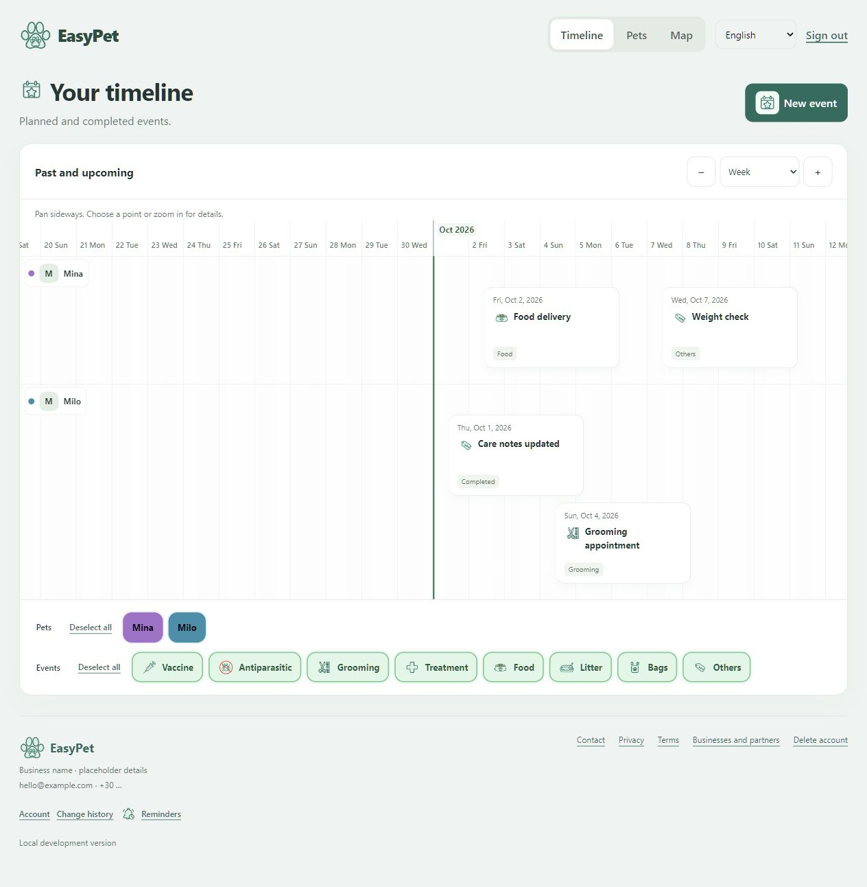

# EasyPet

**Shared pet care, with a clear record of what happened and what comes next.**

A Greek-first web and Android application for pet profiles, care events, reminders and optional caregiver collaboration. Built by Tilemachos Tragakis with Codex assistance.

**Status:** working local development application; preparing a small invited owner/shared-care trial. Not publicly launched or claimed production-ready. This repository is a curated portfolio case study. The application source remains private.

[One-minute walkthrough](WALKTHROUGH.md) · [Architecture and decisions](ARCHITECTURE.md) · [Verification boundaries](VERIFICATION.md) · [Public Python sample](https://github.com/RagDel/completion-recurrence)

## The problem

When several people care for a pet, remembering a date is only part of the problem. They also need to know whether something was completed, who changed it, which record is current and what another caregiver is allowed to do.

EasyPet organizes that work around pet profiles and a shared timeline. The core can be used by one owner; invitations are optional.

## Implemented in the local application

- A pan/zoom timeline with pet colours, species-aware event categories and filters.
- Pet profiles, private event documents and provider contact reuse.
- View-only or editing access, owner-managed invitations and attributed changes.
- Repeats anchored to actual completion, configurable reminders and Android snooze/retry behaviour.
- Shared Django API for a React website and native Kotlin Android app.
- Account export, session revocation and a cancellable account-deletion process.

## Engineering focus

| Problem | Design choice |
|---|---|
| Two caregivers edit the same record | Server authorization and version checks; preserve edits when resolving conflicts |
| A completion request is retried | Idempotent handling so one completion does not create duplicate successors |
| A task is completed later than planned | Calculate its next occurrence from actual completion |
| Access changes while a screen is open | Revalidate and clear stale views; enforce access in the API |
| A phone or PC restarts | Persist encrypted device sessions and validate them with the server |
| A backup predates an account deletion | Reapply independent deletion receipts during restoration |

## Stack

**Backend:** Python, Django, Django REST Framework, PostgreSQL.

**Website:** React, TypeScript, Vite.

**Android:** Kotlin, Jetpack Compose.

**Local operations:** Docker Compose; separate production configuration, not yet deployed.

## Ownership and development

I define the product requirements and scope, choose the user-facing behaviour and review/test the experience. Codex assists with implementation, debugging, tests, research and documentation. This is an AI-assisted project; the case study does not imply that every line was written manually.

## About the screenshots

The images show the actual web build connected to an isolated, read-only fixture server. All account, pet, event and caregiver records in these captures are fictional. They illustrate the interface; they are not evidence of live notifications, production availability or an Android runtime. No private database records are used.

The walkthrough is available directly in this repository without creating an account or running the private app. For runnable public code, see [completion-recurrence](https://github.com/RagDel/completion-recurrence).

## Scope boundaries

iOS is deferred. Professional booking/payment services, billing, public hosting and diagnostic AI are not part of the released offering. Account deletion and pet-profile deletion have different retention semantics; see [architecture](ARCHITECTURE.md). The product name is a working brand, not a claim of trademark registration.

Published for portfolio review. This repository does not grant a license to the private application or its branding. No open-source reuse license has been selected for these case-study materials.
