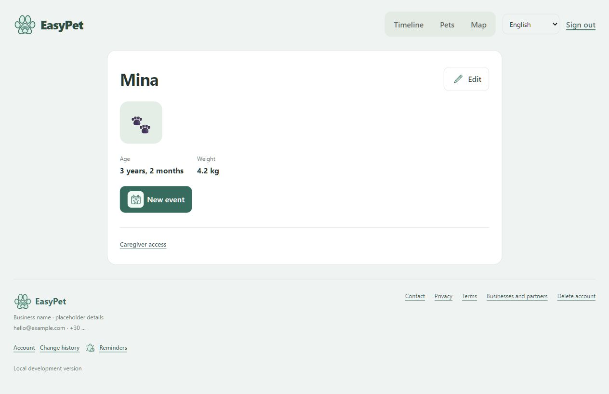
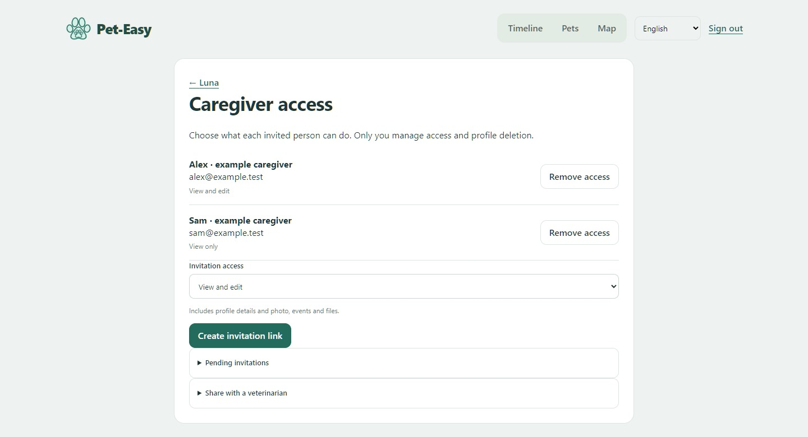

# A one-minute walkthrough

**Pet-Easy** is the current product name. The captured local build still displays its previous name, **EasyPet**.

These are screenshots of the actual web interface with an isolated fictional dataset. They are not a live public account. No medical interval in the demonstration should be interpreted as care advice.

## 1. See shared care in context

The owner can pan through time, change scale and filter by pet or event type. Pet colours maintain context when records for more than one animal are visible.

## 2. Open a pet

A profile gathers the pet's details and records. Event documents and saved provider contact details build on the same shared API rather than separate client databases.

## 3. Make access deliberate

Invitations distinguish viewing from editing. The owner manages access, while attributed history helps caregivers understand changes. The screenshot contains only example.test addresses.

## Inspect something runnable

The [completion-recurrence sample](https://github.com/RagDel/completion-recurrence) has a CLI and standard-library tests. It isolates one scheduling contract from the larger private project so the implementation can be reviewed and run independently.
