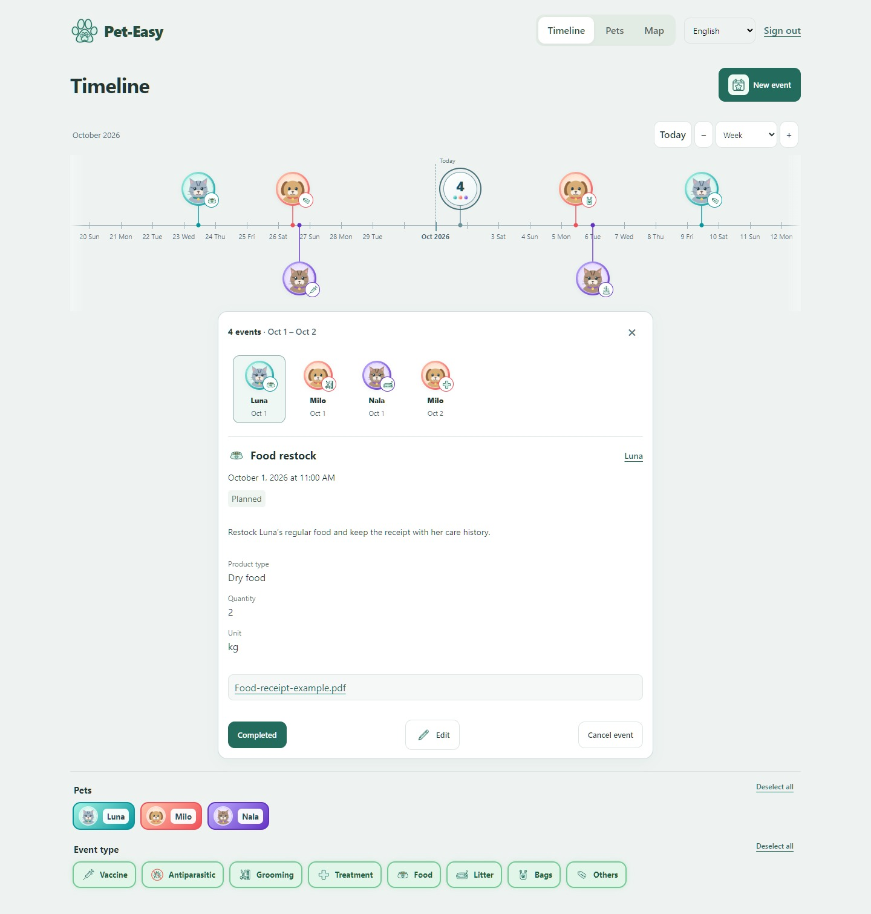
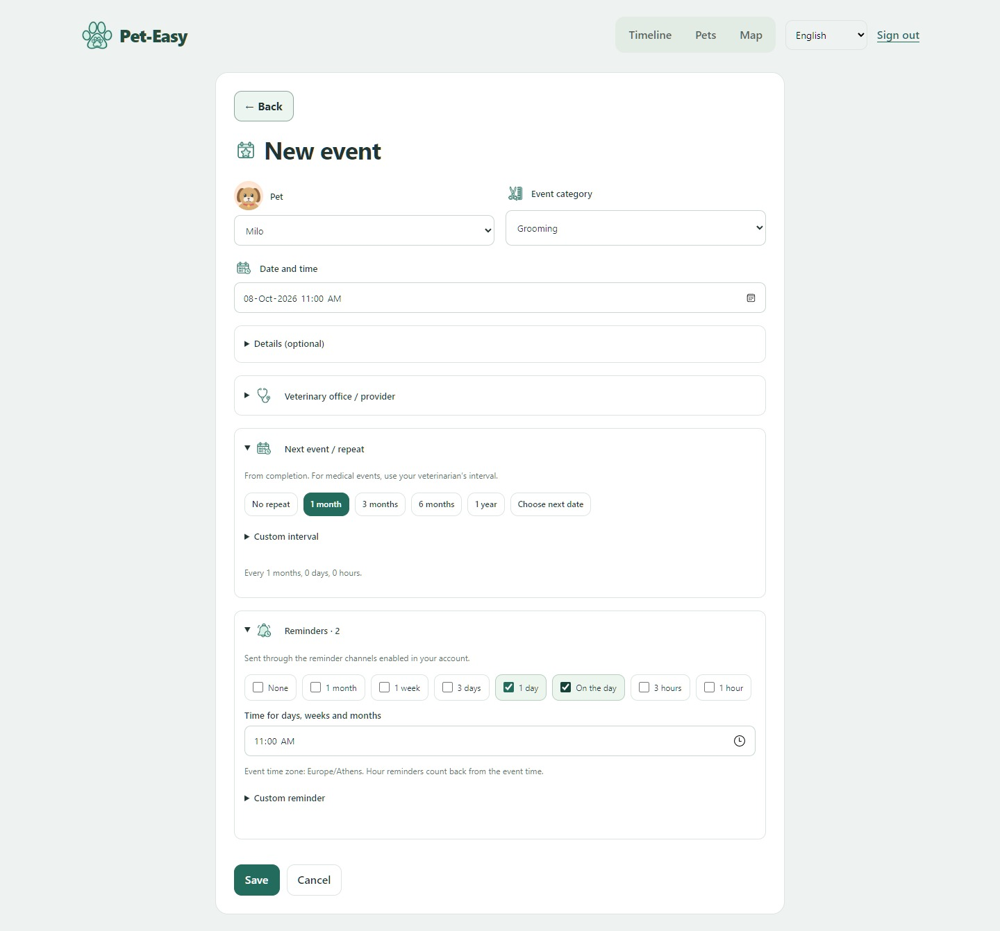
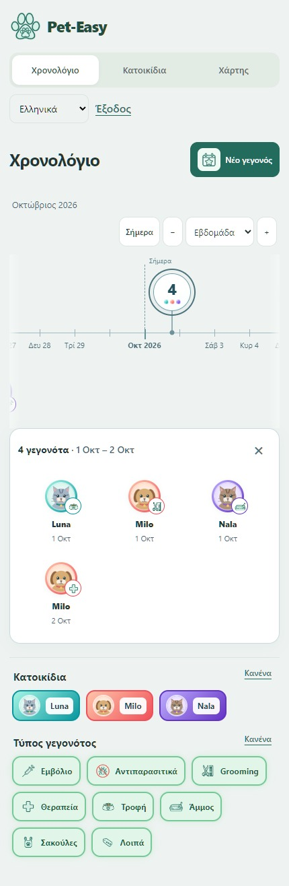

# Pet-Easy: a visual walkthrough

Current interface preview · **1 October 2026**

These captures show the actual React web interface with fictional pets, events and caregiver accounts. They demonstrate the UI; recorded API and native Android checks are described separately in [Verification](VERIFICATION.md).

## 1. See every pet on one timeline

Photo and category bubbles share one date axis. Pan through past and upcoming care, change scale, filter pets or event types, and use Today to return to the current date. Overlapping events group at the selected zoom.

## 2. Expand busy dates without leaving the page

A group's count includes every event. Opening it reveals a bounded grid; selecting an item shows its details and permitted actions on the same page. This keeps a multi-pet household's history readable as the schedule becomes denser.

## 3. Give each pet a recognizable identity

Profiles combine a cropped photo, age or birthday, weight and a personal color. Twenty-four gradient presets and custom endpoints carry that identity through the timeline. Existing solid colors remain supported.

## 4. Plan care around completion

Record care details, select a provider, choose an optional repeat and set reminder lead times. Repeats count from actual completion. Medical repeats begin unset; owners follow their veterinarian's instructions. Demonstration dates and intervals are fictional.

## 5. Make shared care deliberate

Invite someone with View only or View & edit access. Owners manage sharing; caregivers can leave a shared pet. Attributed change history helps everyone follow updates without losing ownership boundaries.

## 6. Keep the timeline usable on a smaller screen

This is the **responsive website at phone width**. The native Android application uses Kotlin and Jetpack Compose; its verification is recorded separately. Both clients follow the same product behavior contracts.

## Beyond these screens

Provider discovery adds nearest-first results, grouped map pins, Greek/Latin city search and external Google Maps links. Private event documents, data export, reminder snoozes and account controls extend the core journey.

Explore the [architecture](ARCHITECTURE.md), [agent-and-skill workflow](AGENT_WORKFLOW.md), or [runnable Python recurrence sample](https://github.com/RagDel/completion-recurrence). Managed cloud deployment and public release are upcoming milestones.
